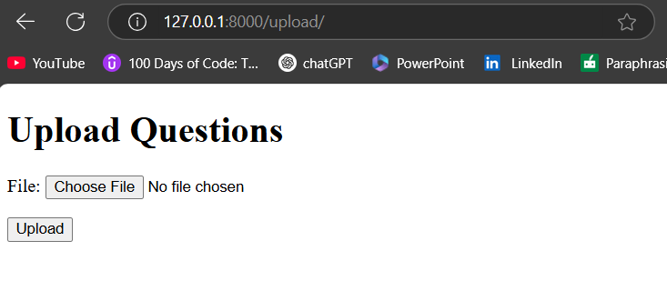
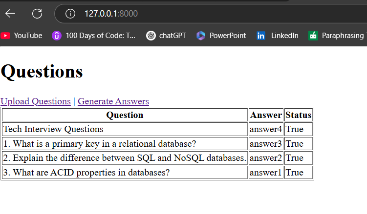
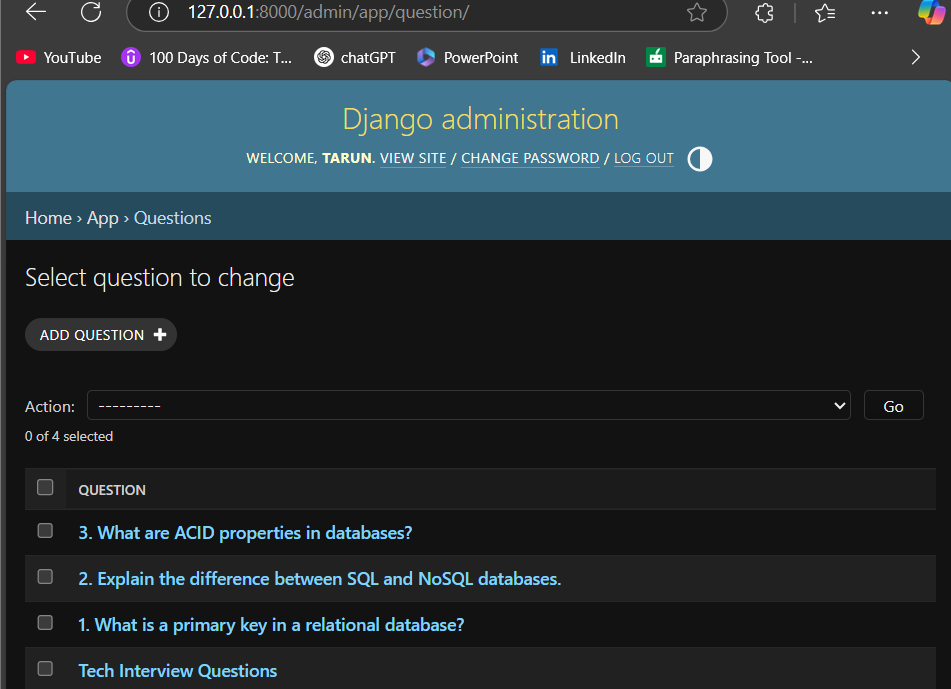

# 🧠 Question Answer Manager using Django + OpenAI

A web application that reads technical questions from a `.docx` file, stores them in a database, and uses OpenAI's GPT API to generate and save answers — all in a clean, user-friendly interface.

---

## 🚀 Features

- 📄 Upload a `.docx` file containing questions
- 📥 Store questions in a database
- 🤖 Auto-generate detailed answers using OpenAI GPT
- ✅ Mark questions as answered or pending
- 🧾 Admin panel to manage all entries

---

## 🛠️ Tech Stack

- **Backend**: Django
- **Database**: SQLite (default), PostgreSQL supported
- **AI Integration**: OpenAI API (GPT-3.5)
- **File Parsing**: `python-docx`

---

## 🖥️ Screenshots

- ✅ Upload `.docx` file with questions
- 📋 View list of all questions and answers
- 🧠 Generate answers with a single click

---

## 🧑‍💻 How to Run Locally

1. **Clone this repository**
   ```bash
   git clone https://github.com/your-username/question-answer-manager.git
   cd question-answer-manager
2. **Create virtual environment**
    ```python -m venv env
     source env/bin/activate   # Windows: env\Scripts\activate
    ```
3. **Install dependencies**
    ```pip install -r requirements.txt```
4. **Add your OpenAI API key**
   ### In settings.py, add:

   ``` OPENAI_API_KEY = 'your-openai-api-key'```
5. **Run migrations**

    ```python manage.py makemigrations
    python manage.py migrate
    ```
6. **Start the development server**
    ```python manage.py runserver```

7. **Open in browser**
    ```http://localhost:8000```


## 🖥️ Screenshots

### 🔼 Upload Page


### ✅ Answer Generated


### 🔧 Admin Panel



# 🏁 Future Ideas
    1. Add login & user roles
    2. Export answered questions to PDF/Excel
    3. Add tagging for topics (DB, Python, etc.)